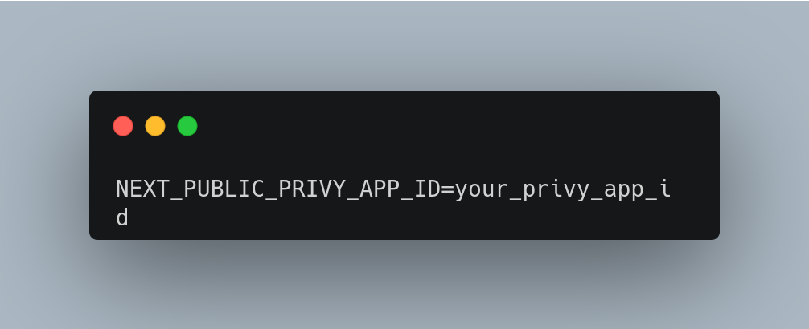

<p align="left">
  
  
  
  
  
</p>


## Overview
This project is a **stablecoin payment DApp** that allows users to send payments to friends within their contact list. It uses **Privy** for seamless authentication, **Next.js** for a fast and responsive client-side interface, and features a clean, refined UI for an intuitive user experience.

## Features

- **User Authentication**: Seamless and secure authentication using Privy.
- **Stablecoin Payments**:  Easily send payments to friends within your contact list.
- **Smart Contracts**: Written in Solidity for blockchain interactions.
- **Payment Requests:**: Request payments from friends with just a few clicks
- **Responsive UI**: A clean and modern interface built with Next.js.

## Setup Instructions

### Prerequisites
Before you begin, ensure you have the following installed:
- **Node.js** (v16 or higher)
- **npm** or **yarn** (Node.js package managers)
- **Git** (for cloning the repository)
- **MetaMask** or any Ethereum wallet (for interacting with the DApp)


### Installation

1. **Clone the Repository**
   - Open your terminal or command prompt.
      ```bash
     cd dapp-project
     ```
   - Run the following command to clone the repository:
   - 
     ```bash
     git clone https://github.com/claudioussamuel/JustPay
     ```

2. **Install Dependencies**
   - Install all required dependencies by running:
     ```bash
     npm install
     ```
     or if you're using Yarn:
      ```bash
     yarn  install
     ```
     


3. **Set Up Environment Variables**
   - Create a `.env.local` file in the root directory of the project.
      ```env
     NEXT_PUBLIC_PRIVY_APP_ID=your_privy_app_id
     NEXT_PUBLIC_INFURA_API_KEY=your_infura_api_key
     ```
   - Add the following environment variables:
     

     - Replace `your_privy_app_id` with your actual Privy App ID (get it from the [Privy Dashboard](https://privy.io/)).
     - Replace `your_infura_api_key` with your Infura API key (if you're using Infura for Ethereum node access).

4. **Run the Development Server**
   
   - Start the development server by running:
    ```bash
     npm run dev
     ```
     or if you're using Yarn:
     ```bash
     yarn run dev
     ```
     
    - Open your browser and navigate to:
   ```bash
     http://localhost:3000
     ```


### Usage

1. **Connect Your Wallet**
   - Click the **Connect Wallet** button on the homepage.
   - Use **Privy** to authenticate and link your Ethereum wallet (e.g., MetaMask).

2. **Add Friends to Your Contact List**
   - Navigate to the **Contacts** section.
   - Add friends by entering their wallet addresses or usernames.

3. **Send Payments**
   - Go to the **Send Payment** section.
   - Select a friend from your contact list and enter the amount.
   - Confirm the transaction in your wallet.

4. **Request Payments**
   - Go to the **Request Payment** section.
   - Select a friend and specify the amount.
   - Your friend will receive a payment request notification.

5. **View Transaction History**
   - Check the **Transaction History** section to view all sent and received payments.

---

### Additional Notes

- **Smart Contracts**:
  - If you need to deploy or interact with smart contracts, ensure **Hardhat** is set up.
  - Compile and deploy the contracts:
    ```bash
    npx hardhat compile
    npx hardhat deploy
    ```
  - Run tests for the smart contracts:
    ```bash
    npx hardhat test
    ```

- **Testing the DApp**:
  - Use testnet stablecoins (e.g., USDT on Goerli) to simulate payments.
  - Ensure your wallet is connected to the correct Ethereum network (e.g., Goerli Testnet).

---

### Troubleshooting

- **Environment Variables**: Ensure all required environment variables are set in `.env.local`.
- **Wallet Connection**: If the wallet fails to connect, ensure your wallet (e.g., MetaMask) is installed and unlocked.
- **Transaction Issues**: If transactions fail, check your wallet balance and network connection.


