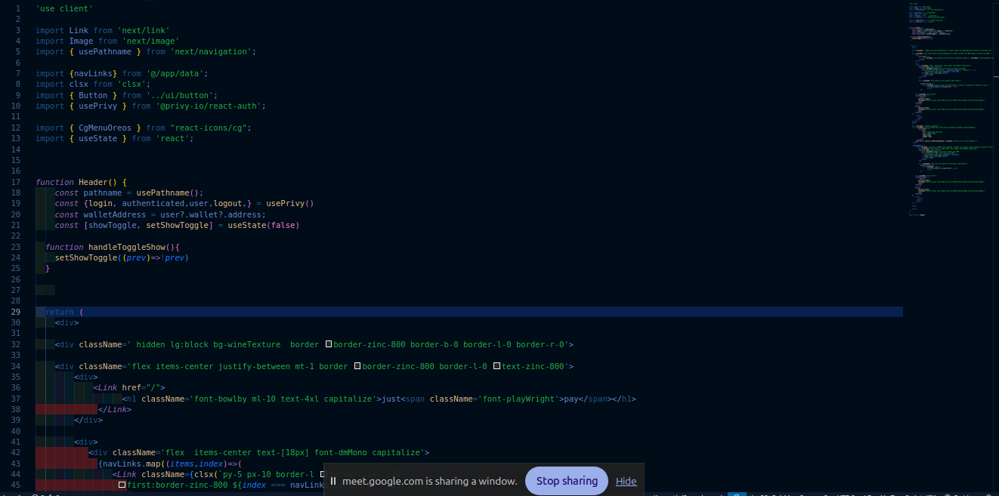
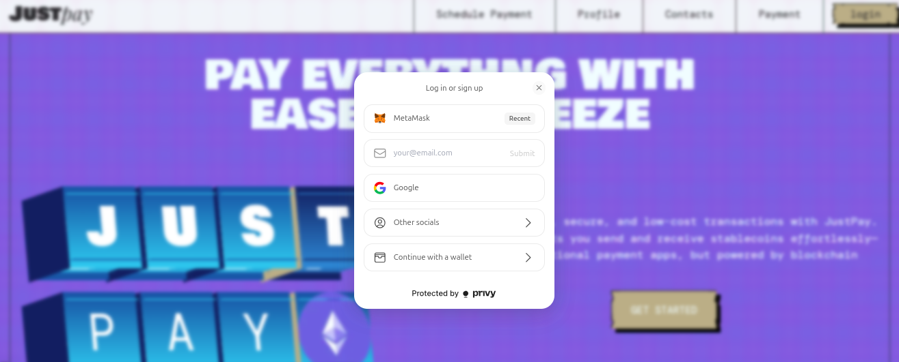
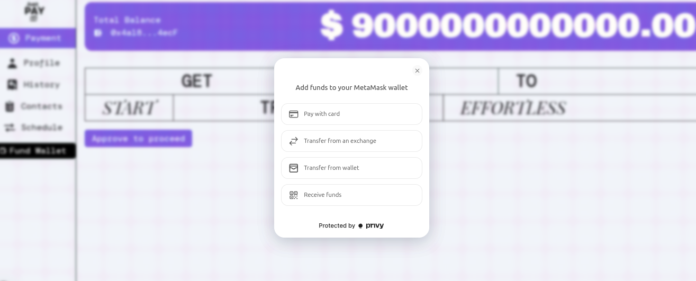
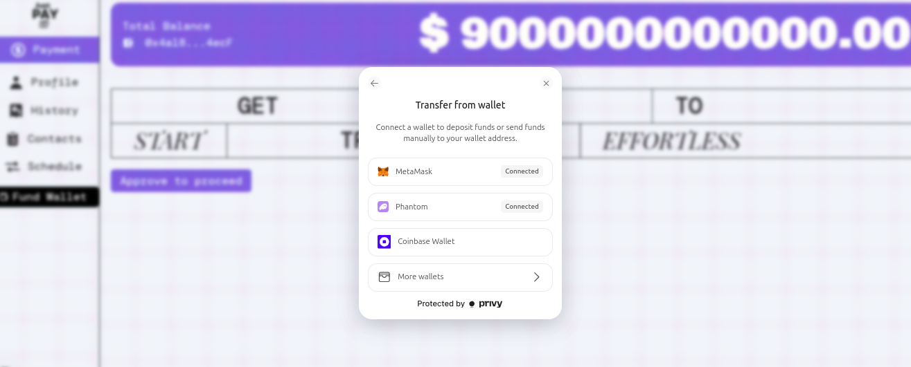

<p align="left">
  
  
  
  
    
  
</p>

## Overview

This project is a **stablecoin payment DApp** that allows users to send payments to friends within their contact list. It uses **Privy** for seamless authentication, **viem** for blockchain interactions, **Next.js** for a fast and responsive client-side interface, and features a clean, refined UI for an intuitive user experience.

## Features

- **User Authentication**: Seamless and secure authentication using Privy.
- **Stablecoin Payments**: Easily send payments to friends within your contact list.
- **Smart Contracts**: Written in Solidity for blockchain interactions.
- **Payment Requests**: Request payments from friends with just a few clicks.
- **Responsive UI**: A clean and modern interface built with Next.js.

## Setup Instructions

### Prerequisites

Before you begin, ensure you have the following installed:

- **Node.js** (v16 or higher)
- **npm** or **yarn** (Node.js package managers)
- **Git** (for cloning the repository)
- **Foundry** (for smart contract development and testing)
- **MetaMask** or any Ethereum wallet (for interacting with the DApp)

### Installation

1. **Clone the Repository**

   - Open your terminal or command prompt.
     ```bash
     git clone https://github.com/claudioussamuel/JustPay
     ```
     ```bash
     cd frontend
     ```

2. **Install Dependencies**
   - Install all required dependencies by running:
     ```bash
     npm install
     ```
     or if you're using Yarn:
     ```bash
     yarn install
     ```
3. **Set Up Environment Variables**
   - Create a `.env.local` file in the root directory of the project.
   - Add the following environment variables:
     ```env
     NEXT_PUBLIC_PRIVY_APP_ID=your_privy_app_id
     NEXT_PUBLIC_PRIVY_APP_SECRET=your_privy_secret_key
     NEXT_PUBLIC_SEPOLIA_ID=your_alchemy_api_key
     NEXT_PUBLIC_PINATA_JWT=your_pinata_jwt
     NEXT_PUBLIC_GATE_WAY=your_gate_way
     ```
     - Replace `your_privy_app_id` with your actual Privy App ID (get it from the [Privy Dashboard](https://privy.io/)).
     - Replace `your_alchemy_api_key` with your Alchemy API key (if you're using Alchemy for Ethereum node access).


### **Privy Integration Overview**

This project integrates **Privy** to enhance user authentication, wallet management, and blockchain interactions. Below is a concise explanation of each key feature:

---

### **1. Embed Wallet for Social Login**
Privy allows users to log in using **social accounts** (Google, Twitter, etc.) or **email/password**, while seamlessly embedding a wallet for web3 interactions. This bridges the gap between web2 and web3, enabling non-crypto-native users to interact with the blockchain effortlessly.

---

### **2. Privy Provider with viem for Blockchain Interactions**
Privy integrates with **viem**, a lightweight Ethereum library, to facilitate secure and efficient blockchain interactions. This combination enables:
- **Wallet Management**: Privy manages user wallets, while viem handles smart contract calls and blockchain queries.
- **Seamless Integration**: Developers can use viem's APIs to interact with the blockchain, with Privy handling authentication and wallet connections.

---

### **3. Privy for Signing Transactions and Transacting with the Blockchain**
Privy simplifies **transaction signing** and **blockchain interactions** by:
- **Wallet Abstraction**: Users can sign transactions without needing to manage private keys directly.
- **User-Friendly Flows**: Privy provides pre-built UI components for transaction signing, making it easy for users to approve and send transactions.

---

### **4. Privy for Funding the Wallet Through Coinbase**
Privy enables **on-ramp functionality**, allowing users to fund their embedded wallets via **Coinbase** or other payment providers. This feature:
- **Simplifies Crypto Onboarding**: Users can purchase crypto directly within the app.
- **Supports Multiple Payment Methods**: Integrates with Coinbase and other on-ramp providers for seamless funding.

---

### **Summary**
By leveraging Privy, this project delivers a **unified authentication and wallet management solution**, enabling:
- **Social logins** with embedded wallets.
- **Secure blockchain interactions** via viem.
- **Transaction signing** and **on-chain interactions**.
- **Easy wallet funding** through Coinbase and other on-ramp providers.


   

### Usage

0. **Mint Test ERC20 Tokens**

   - Before interacting with the DApp, you'll need to mint test ERC20 tokens from this address:
     ```
     0xd484a0463a540E59Ff10954F74c2ec2efd785abc
     ```
   - Connect your wallet to the appropriate testnet and interact with this contract to mint tokens.
   - These tokens will be used for testing payment functionality within the DApp.

1. **Connect Your Wallet**

   - Click the **Connect Wallet** button on the homepage.
   - Use **Privy** to authenticate and link your Ethereum wallet (e.g., MetaMask).
  
2. **Add Friends to Your Contact List**

   - Navigate to the **Contacts** section.
   - Add friends by entering their wallet addresses or usernames.

3. **Send Payments**

   - Go to the **Send Payment** section.
   - Select a friend from your contact list and enter the amount.
   - Confirm the transaction in your wallet.

4. **Request Payments**

   - Go to the **Request Payment** section.
   - Select a friend and specify the amount.
   - Your friend will receive a payment request notification.

5. **View Transaction History**
   - Check the **Transaction History** section to view all sent and received payments.





---

### Additional Notes

- **Smart Contracts**:

  - The project uses **Foundry** for smart contract development, testing, and deployment.
  - Compile, test, and deploy contracts:

    ```bash
    # Compile contracts
    forge build

    # Run tests
    forge test

    # Deploy contracts
    forge script script/Deploy.s.sol --rpc-url <your_rpc_url> --private-key <your_private_key>
    ```

- **Wallet Integration**:

  - The project uses **viem** with **Privy** for wallet connections and blockchain interactions.
  - This combination provides a streamlined user experience while maintaining security.

- **Testing the DApp**:
  - Use testnet stablecoins (e.g., USDC on Goerli) to simulate payments.
  - Ensure your wallet is connected to the correct Ethereum network (e.g., Goerli Testnet).

---

### Troubleshooting

- **Environment Variables**: Ensure all required environment variables are set in `.env.local`.
- **Wallet Connection**: If the wallet fails to connect, ensure your wallet (e.g., MetaMask) is installed and unlocked.
- **Transaction Issues**: If transactions fail, check your wallet balance and network connection.
- **Foundry Issues**: Make sure Foundry is properly installed and updated to the latest version.


### Project Structure

---

## **1. Smart Contracts (`/contracts`)**
The `contracts` folder contains all the code related to the blockchain and smart contracts.

### **Key Subfolders:**
- **`test/`**: 
  - Contains unit tests and integration tests for the smart contracts.
  - Ensures the contracts function as expected before deployment.
    
- **`scripts/`**: Houses deployment scripts (e.g., using Foundry) to deploy contracts to various networks (mainnet, testnet, etc.).
  - Stores deployed contract artifacts (ABIs, addresses, etc.) for easy access by the frontend.
    
- **`src/`**:
  - Contains the main Solidity smart contract files.
  - Organized into logical modules (e.g., `JustPay.sol`).

---

## **2. Frontend (`/frontend`)**
The `frontend` folder contains the code for the user interface and application logic.

### **Key Subfolders:**
- **`src/`**:
  - **`app/`**:
    - Contains the main application logic and routing configuration (`appRoutes`).
    - Handles navigation and page rendering based on routes.
  - **`components/`**:
    - Houses reusable UI components (e.g., buttons, modals, cards).
    - Promotes code reusability and maintainability.
  - **Other Files**:
    - Includes utility functions, hooks, and context providers.
- **`.env.local`**:
  - Stores environment-specific variables (e.g., API keys, contract addresses).
  - Ensures sensitive data is not hardcoded into the application.

---

## **3. Benefits of This Structure**
- **Centralized Codebase**: Both frontend and smart contracts are in one place, making it easier to manage dependencies and workflows.
- **Modular Design**: Separates concerns (e.g., contracts, frontend, tests) for better organization.
- **Ease of Deployment**: Deployment scripts and artifacts are stored alongside the contracts, simplifying the deployment process.
- **Reusable Components**: Frontend components are modular and reusable, reducing duplication of code.
- **Environment Management**: `.env.local` ensures sensitive data is securely managed and not exposed in the codebase.

---

### **Wow Factor: Schedule Payments with Smart Contracts**

This feature allows users to **schedule payments** to be sent to someone at a specific date and time. The smart contract will automatically execute the payment at the scheduled time **without requiring further interaction** from the user or the application.

---

#### **How It Works**
1. **User Input**:
   - The user specifies:
     - The recipient's address.
     - The amount to send.
     - The date and time for the payment.

2. **Smart Contract**:
   - A smart contract is deployed to handle scheduled payments.
   - The contract stores:
     - The payment details (recipient, amount, timestamp).
     - The sender's address and funds.

3. **Automated Execution**:
   - The smart contract uses a **time-based trigger** (e.g., block timestamp) to execute the payment at the specified time.
   - Once the scheduled time is reached, the contract automatically sends the funds to the recipient.

4. **No Code Interaction**:
   - After the payment is scheduled, no further interaction with the application or code is required.
   - The smart contract handles everything autonomously.

---

#### **Key Features**
- **Time-Based Execution**: Payments are executed automatically at the specified time.
- **Trustless**: No need to trust a third party; the smart contract ensures the payment is sent as scheduled.
- **Gas Efficiency**: Optimized to minimize gas costs for scheduling and executing payments.
- **User-Friendly**: Simple interface for users to schedule payments.

---
### **Key Features of the App**

1. **Send Transaction / Request Transaction**  
   - Users can send funds or request payments from other users.  
   - Supports seamless blockchain transactions with clear confirmation steps.

2. **Accept and Decline Request**  
   - Users can review incoming payment requests and choose to accept or decline them.  
   - Provides a clear and intuitive interface for managing requests.

3. **Funding Wallet**  
   - Users can fund their wallets using on-ramp services like Coinbase.  
   - Simplifies the process of adding crypto to the wallet.

4. **History Page**  
   - Displays a detailed transaction history for all incoming and outgoing payments.  
   - Helps users track their financial activities.

5. **Add Contacts**  
   - Users can add other wallet addresses as contacts for easy transactions.  
   - Streamlines the process of sending or requesting funds.

6. **Search for Contacts**  
   - Allows users to search through their contacts list quickly.  
   - Makes it easy to find specific contacts for transactions.

7. **Pagination**  
   - Implements pagination for transaction history and contacts list.  
   - Ensures smooth navigation and better performance for large datasets.
  
### **Special Instruction: Setting Up Cron Job for Blockchain Transactions**

Follow these steps to set up a cron job that sends transactions to the blockchain using **viem** and a **private key**:

---

#### **1. Visit Cron-Job.org**
- Go to [https://console.cron-job.org](https://console.cron-job.org).
- Create an account or log in if you already have one.

---

#### **2. Prepare Your Private Key**
- Ensure you have the **private key** of an Ethereum address that will be used to send transactions.
- Store the private key securely in your environment variables (e.g., `.env.local`) as `NEXT_PUBLIC_META_MASK`.

---

#### **3. Set Up the Cron Job**
1. **Create a New Cron Job**:
   - In the cron-job.org dashboard, click on **"Create Cron Job"**.
   - Set the **URL** to your application's API endpoint:  
     ```
     https://justpaystablecoin.vercel.app/api/cron
     ```
   - Configure the **schedule** (e.g., every 5 minutes, hourly, etc.).

2. **Add Headers (Optional)**:
   - If your API requires authentication, add the necessary headers (e.g., API keys) in the cron job settings.

3. **Save the Cron Job**:
   - Once configured, save the cron job and ensure it is active.

---

#### **4. Implement the API Endpoint**
- In your application, create an API route (e.g., `/api/cron`) that:
  1. Uses **viem** to interact with the blockchain.
  2. Signs and sends transactions using the private key stored in `NEXT_PUBLIC_META_MASK`.
  3. Handles any errors and logs the transaction status.

---

#### **5. Test the Cron Job**
- Manually trigger the cron job to ensure it works as expected.
- Verify that transactions are being sent to the blockchain successfully.

---

### **Example Code Snippet for API Endpoint**
```javascript
import { contractAddress, contractAbi } from '@/lib/integrations/viem/abi';
import { NextResponse } from 'next/server';
import { createWalletClient, getContract, http, publicActions } from 'viem';
import { privateKeyToAccount } from 'viem/accounts';
import { sepolia } from 'viem/chains';

export async function GET() {
  const PRIVATE_KEY = process.env.NEXT_PUBLIC_META_MASK_PRIVATE_KEY
    ? process.env.NEXT_PUBLIC_META_MASK_PRIVATE_KEY.startsWith('0x')
      ? (process.env.NEXT_PUBLIC_META_MASK_PRIVATE_KEY as `0x${string}`)
      : (`0x${process.env.NEXT_PUBLIC_META_MASK_PRIVATE_KEY}` as `0x${string}`)
    : null;

  if (!PRIVATE_KEY) {
    return NextResponse.json(
      { error: 'Private key is missing or invalid' },
      { status: 400 }
    );
  }

  const BASE_SEPOLIA = `https://eth-sepolia.g.alchemy.com/v2/${process.env.NEXT_PUBLIC_SEPOLIA_ID}`;
  const account = privateKeyToAccount(PRIVATE_KEY);

  try {
    const client = createWalletClient({
      account,
      chain: sepolia,
      transport: http(BASE_SEPOLIA),
    }).extend(publicActions);

    const contract = getContract({
      address: contractAddress,
      abi: contractAbi,
      client,
    });

    await contract.write.executeTransactions();

    return NextResponse.json({ message: 'Transactions executed successfully' });
  } catch (error) {
    console.error('Error executing transactions:', error);
    return NextResponse.json(
      { error: 'Failed to execute transactions' },
      { status: 500 }
    );
  }
}
---


